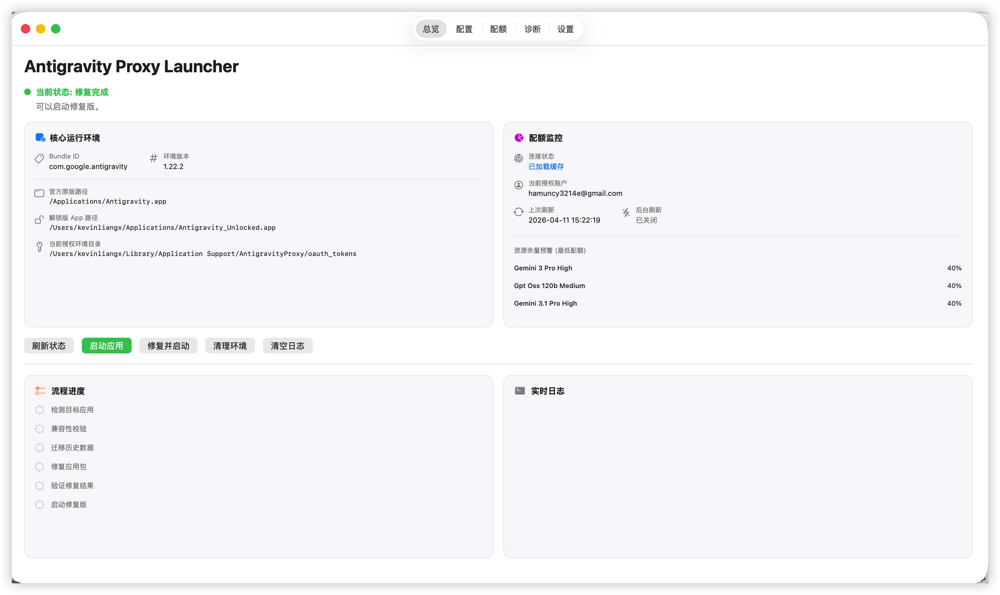
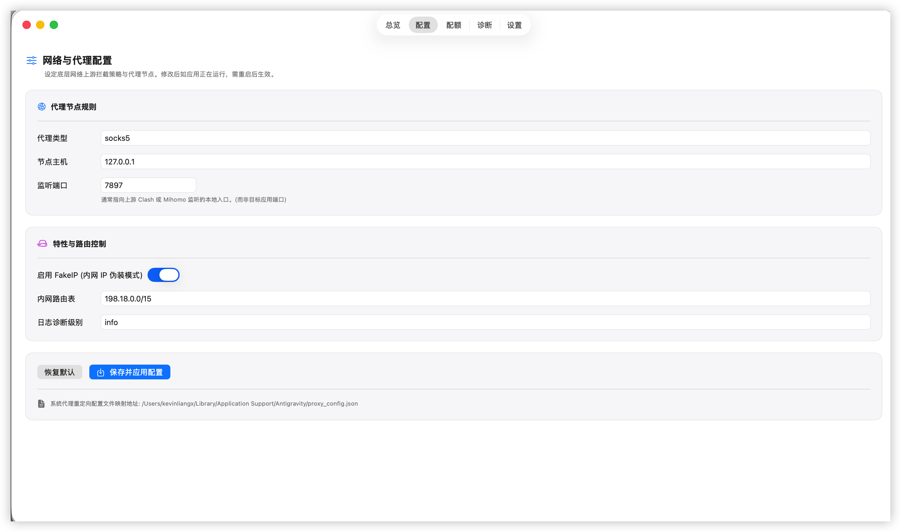
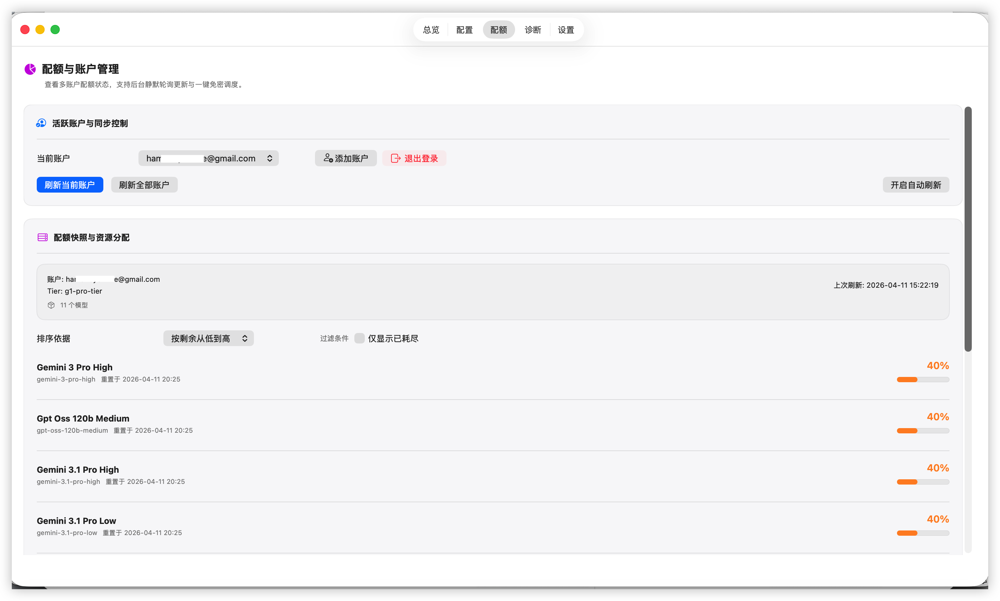
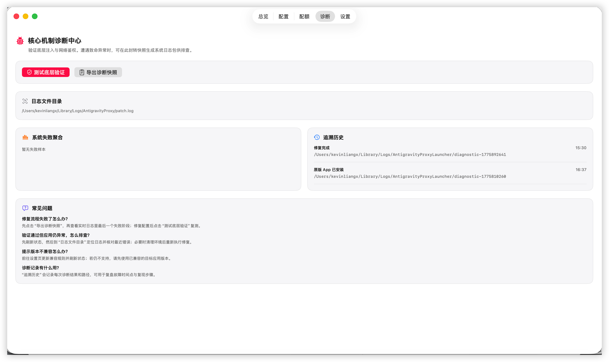
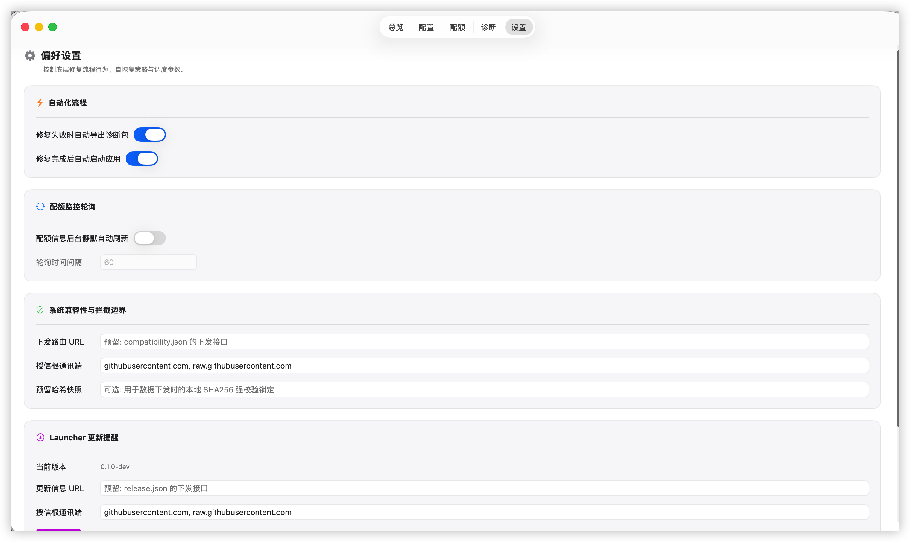

# Antigravity Proxy Launcher (v2.0)

欢迎来到 **Antigravity Proxy Launcher** v2.0 仓库。
本项目通过动态库（dylib）注入与 macOS 环境重配机制，对目标应用进行代理增强与规则修补，并提供开箱即用的原生桌面级体验。

> **注意：**: Google 推出了桌面版本的gemini应用，依然无法通过普通的代理进行访问，本项目增加了gemini应用的代理支持。
> 项目名称后续会更改为GoogleProxyLauncher。

---

## 1. 过去的样子与技术原理 (v1.0)

在 v1.0 阶段，本项目的核心受脱壳补丁思想启发，主要是一套运行在终端里的 Shell 脚本集合（如 `run_unlocked.sh`）。
用户必须手动在 Terminal 中执行命令行脚本才能完成 `xattr` 属性清理、`dylib` 注入、沙盒数据迁移、重签名以及目标应用的代理重启。

**如果你想探究底层核心的劫持原理（如 `DYLD_INSERT_LIBRARIES`、Inside-out 重签名、基于环境变量的代理控制等）**，它们在 v2.0 中依然是底层的技术基石。详细原理解析请参阅我们特意归档的旧版文档：
👉 [**v1.0 架构与技术原理文档 (docs/README_v1.md)**](docs/README_v1.md)

---

## 2. 现在的架构 (v2.0)

经过 v2.0 的全面重构，本项目已升级为工程级标准库，将底层二进制级别的注入逻辑与图形交互页面的状态调度分离：

- **`AntigravityTun/`**：[核心注入层] 包含基于 C/C++ 与 Objective-C 编写的劫持动态库，编译产物为 `libAntigravityTun.dylib`。
- **`launcher/`**：[原生交互层] 基于 Swift / SwiftUI 构建的 macOS 原生桌面 App。主要负责状态编排、兼容判断、数据调度以及提供 GUI 面板。
- **`docs/`**：[设计与规范] 架构提案、发布手册、开发环境配置方案以及历史归档。
- **`legacy_scripts/` & `tools/`**：[历史与脚手架] v1 版本的 bash 注入方案原型，以及 Socks5 mock 等辅助测试脚本已收入其中。

---

## 3. v2.0 增加了哪些新功能？

我们彻底抛弃了简陋的“一键黑框脚本”，v2.0 为用户带来了成熟软件级别的增强体验：

- ✨ **原生 macOS 桌面 App化**：告别终端敲命令。采用 SwiftUI 全新构建的总览 Dashboard 界面，全流程展示注入和准备状态。
- 🛡 **智能检测与兼容性引擎**：动态扫描本机的目标应用，对比内置与远程更新的兼容性规则库（`compatibility.json`）。对于不支持的 App 版本，执行强拦截以防止破坏性写入操作污染原版 App。
- 📦 **安全沙盒与自动回滚**：支持失败全自动回滚，修出问题自动恢复干净环境。修复包单独隔离在 `~/Applications/` 下。
- 📊 **可视化代理配置**：内置本地与远程代理信息的读写系统，可在界面配置（`proxy_config.json`），免进目录改文件。配额面板（Quota）可对接后端实时检测流量消耗。
- 🩺 **强大的诊断与日志跟踪**：增加专门的诊断页（Diagnostics），包含系统失败聚合追踪。支持一键导出排障日志压缩包和快速测试底层验证模块。
- 🚀 **自动化打包与分发流水线 (CI/CD)**：借助 XcodeGen 与脚本矩阵，支持纯命令行一键输出带新应用图标的正式 `.dmg` 及 `.zip` 无签名/带签名交付包。
- 📦 **内置更新订阅驱动**：基于 JSON 远程订阅流 `release.json` 的应用内热更新提示，支持跳过/恢复更新。

## 4. 安装与运行指南

1. **下载与安装**：获取最新的 `.dmg` 安装包，双击打开后，将 `Antigravity Proxy Launcher.app` 拖入到 `Applications`（应用程序）文件夹中。
2. **首次运行**：前往应用程序文件夹，找到该应用并双击打开。
3. **遇到报错？解除隔离属性**：
   如果你在打开应用时遇到“文件已损坏”或“无法验证开发者”的系统拦截，这是由于 macOS 的 Gatekeeper 安全机制（Quarantine 隔离属性）导致的。你只需要打开**终端 (Terminal)**，执行以下命令将其解除隔离即可：
   ```bash
   xattr -cr /Applications/Antigravity\ Proxy\ Launcher.app
   ```
   执行完毕后，再次双击 App 即可正常无缝运行。

---

## 5. 快速上手：核心功能模块说明

为了让你和用户能在第一次打开 App 时就知道该点什么，这里梳理了五个核心选项卡（Tab）的完整操作指南：

### 🖥️ 1. 总览页 (Dashboard)
**定位：整个 App 的一键启动调度中心**
- **功能说明：** 上方展示你本机的原版 App 检测状态、版本兼容情况以及注入修补包的准备状态。下方实时滚动你在底层抛出的修补进度和验证日志。
- **用户操作：** 如果出现绿色状态，这里会有最大的一个主按钮**「修复并启动」**。没报错的话，你日常只需点这一个按钮，剩下的脏活累活 App 会全自动完成，并帮你调起目标应用。出现更新也会在这个界面顶部弹出横幅。
- **效果图：**


### 🌐 2. 代理设置页 (Config)
**定位：网络节点中转管家**
- **功能说明：** 告别过去每次换节点都要钻进系统隐藏文件夹手动改 `proxy_config.json` 的噩梦。
- **用户操作：** 支持配置 Socks5 / HTTP 等本地与远程节点信息，修改后直接点击保存写入持久化沙盒。
- **效果图：**


### 📈 3. 配额管理页 (Quota)
**定位：流量消耗与订阅看板**
- **功能说明：** 对接服务后端，自动展示你当前节点的传输流量消耗情况、当日上限及总体使用额度。
- **用户操作：** 纯看用，方便随时把握你的代理流量剩余状况。
- **Client 配置：** 安装后已内置默认 Google OAuth 的 `Client ID` 与 `Client Secret`，开箱即可登录；如需替换请前往设置页修改并保存。
- **可选覆盖方式：**
  1. 在设置页填写并保存你自己的 Client 配置；
  2. 或设置环境变量 `AG_GOOGLE_CLIENT_ID` / `AG_GOOGLE_CLIENT_SECRET`（优先级最高）。
- **如何获取 Client 信息（Google Cloud Console）：**
  1. 打开 Google Cloud Console，选择或创建项目。
  2. 进入 `APIs & Services` -> `OAuth consent screen`，完成应用信息配置。
  3. 进入 `APIs & Services` -> `Credentials`，点击 `Create Credentials` -> `OAuth client ID`。
  4. Application type 选择 `Desktop app`（或与你的回调方式匹配的类型），创建后复制 `Client ID` 与 `Client Secret`。
  5. 回到本应用 `设置` 页，填写并点击“保存并应用参数”，后续即可直接登录。
- **效果图：**


### 🩺 4. 常见问题与诊断页 (Diagnostics)
**定位：进阶玩家的“硬核修车铺”**
- **功能说明：** 万一上面第一步的「修复并启动」失败了，这里是你找问题的中控台。包含：底层状态注入验证器、历史失败追踪记录，以及非常实用的**内置 FAQ 指南**。
- **用户操作：** 若运行异常，来这里读 FAQ 或点击「**一键导出诊断快照**」。它会瞬间将你的错误日志打包成 Zip，你可以直接发给二开开发者排查。如果怀疑注入被破坏，可以点「测试底层验证」强制排障。
- **效果图：**


### ⚙️ 5. 偏好设置页 (Settings)
**定位：强迫症患者的规则中枢**
- **功能说明：** 控制 App 自身的行为逻辑，如是否在修复失败时默认导出诊断包，或修复后不自动拉起目标应用。同时包含对底层**云端兼容性规则库**的更新接管。
- **用户操作：** 可在这里添加信任的域名白名单或修改兼容判定规则更新地址。如果收到了不想升级的版本提示，也可以在这里取消忽略。
- **效果图：**


---

## 📚 二次开发与正式版构建分发指南

想要编译这个全新的 v2.0 原生应用？想要为它做二次开发？或者是想发一个内部测试版给朋友用？请直接点开我们这篇最全最精炼的手册：

👉 [**《Antigravity Proxy Launcher 二开、构建与分发完整指南》**](docs/app_build_distribution_guide.md)


## 贡献
欢迎提交 Issue 和 Pull Request！

**免责声明 (Disclaimer)**

**本项目仅供技术研究和教育目的使用。**

1.  本工具主要用于解决特定环境下的网络连接问题，开发者不提供任何形式的保证。
2.  使用者在使用本工具时，必须遵守当地法律法规以及相关网络安全规定。
3.  严禁将本工具用于非法用途（如网络攻击、绕过安全监管等）。
4.  **免责条款**：使用此工具产生的任何直接或间接后果（包括但不限于数据丢失、法律纠纷、系统故障等）均由使用者自行承担，开发者不承担任何法律及连带责任。
5.  如果您下载、复制、编译或运行了本项目代码，即视为您已阅读并同意本声明。
